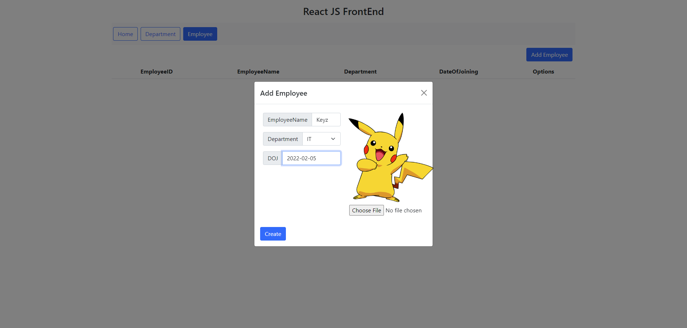

# Department and Employee Management

This project consists of a Node.js API and a React user interface (UI) that allows for CRUD (Create, Read, Update, Delete) operations on Departments and Employees within an organization.

## Key Features

- **Department Management:** Both the API and UI enable the creation, reading, updating, and deletion of departments within the organization.

- **Employee Management:** CRUD operations can be performed on employee information, including names, departments, and joining dates.

## Technologies Used

- **Node.js:** The API is developed in Node.js, making it fast and efficient for handling HTTP requests.

- **React:** The user interface (UI) is built with React, providing an interactive and user-friendly experience.

- **Pure JavaScript:** The UI is developed using pure JavaScript without JSX, allowing for greater control and customization.

## Screenshots

_(Employee Page)_


_(Department Page)_

## Usage Instructions

1. **Clone the Repository:** Clone this repository to your local machine.

2. **Install Dependencies:** In the project folder, run the following command to install dependencies for both the API and the UI:

    ``` npm install ```

4. **Create the Database:** Create a database with the name "NodeProject."

5. **Create Tables:** Create the necessary tables by executing the following queries in your database:

    ```sql
    CREATE TABLE Department (
        DepartmentId INT AUTO_INCREMENT PRIMARY KEY,
        DepartmentName VARCHAR(255) NOT NULL
    );

    CREATE TABLE Employee (
        EmployeeId INT AUTO_INCREMENT PRIMARY KEY,
        EmployeeName VARCHAR(255) NOT NULL,
        Department VARCHAR(255) NOT NULL,
        DateOfJoining DATE NOT NULL,
        PhotoFileName VARCHAR(255) NOT NULL
    );
    ```

6. **Start the API:** Run the Node.js REST API using the following command:

    ``` node index.js ```

7. **Start the React UI:** In the `Ui/crud-ui/` folder, start the React UI with the following command:

    ``` npm run start ```

8. **Access the Application:** Open your web browser and access the application at `http://localhost:3000`. From here, you can perform CRUD operations on Departments and Employees.

## Project Structure

- `index.js`: The main file of the Node.js REST API (contains API routes).
- `Ui/crud-ui/`: The folder containing the React user interface (UI).

## Contribution

If you wish to contribute to this project, we encourage you to do so by following these steps:

1. Fork the repository.

2. Create a branch for your changes: `git checkout -b your-branch`.

3. Make your changes and commit them: `git commit -m "Description of your changes"`.

4. Push your changes to your fork: `git push origin your-branch`.

5. Open a pull request in this repository.

## Author

- KeyzDev

## License

This project is licensed under the MIT License. See the [LICENSE](LICENSE) file for more details.
